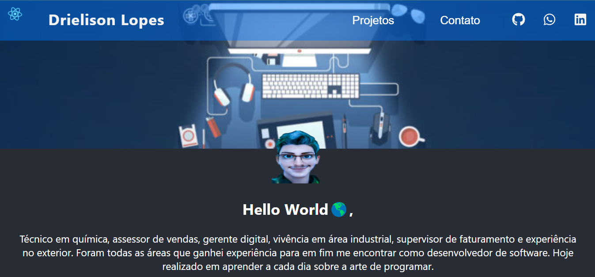

  <a href="">Layout</a>&nbsp;&nbsp;&nbsp;|&nbsp;&nbsp;&nbsp;
  <a href="#-tecnologias">Tecnologias</a>&nbsp;&nbsp;&nbsp;|&nbsp;&nbsp;&nbsp;
  <a href="#-projeto">Projeto</a>

 

  

## 🚀 Tecnologias

Esse projeto foi desenvolvido em React com as seguintes tecnologias:

- HTML
- SCSS
- JavaScript
- NodeJS

## 💻 Projeto

O projeto-react é o meu projeto pessoal desenvolvido em React ⚛
Pode rodar com `yarn start` e ver no seu browser através da porta [http://localhost:3000](http://localhost:3000)

## 👨‍💻 Deploy

Você pode visualizar o projeto através [desse link](https://portifolio-react-drielisonlopes.vercel.app/).

---

Feito com 💙 by Drielison Lopes
